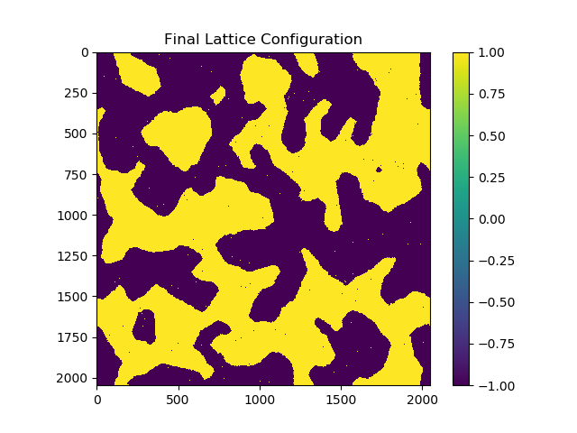

### Tensor Core implementation using CUDA C

### Basic Usage
Compile binary with `make`.

Example run command:

`./ising_tensorcore -g <number of GPUs> -x <rows / 256> -y <columns / 256> -n <number of iterations> `

Run `./ising_tensorcore --help` for more options.

### Visualizing Results
`-o` flag enables output of final lattice configuration to text file `final.txt`. Use provided `plot_ising.py` to visualize output.

For example:
```
$ ./ising_tensorcore -g 2 -x 8 -y 8 -n 100 -a 0.5 -o
...
Writing lattice to final.txt...

$ python plot_ising.py
```

This will produce the following output:


